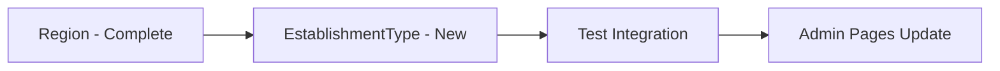
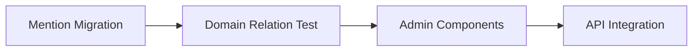
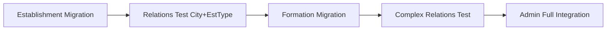

# Matrice d'Impact et Dépendances - Migration Architecture

## 🎯 Matrice de Priorités (Impact vs Effort)

| Entité | Impact Business | Effort Tech | Dépendances | Priorité | Status |
|--------|-----------------|-------------|-------------|----------|---------|
| **Region** | 🔥 Critique | ⚡ Faible | ∅ | **P0** | 🔄 50% |
| **EstablishmentType** | 🔥 Critique | ⚡ Faible | ∅ | **P0** | ❌ 0% |
| **Level** | 🔥 Critique | ⚡ Faible | ∅ | **P0** | ✅ 100% |
| **Domain** | 🔥 Critique | ⚡ Faible | ∅ | **P0** | ✅ 100% |
| **City** | 🔥 Critique | 🟡 Moyen | Region | **P1** | ✅ 100% |
| **Mention** | 🟡 Important | 🟡 Moyen | Domain | **P2** | ❌ 0% |
| **Establishment** | 🔥 Critique | 🔴 Élevé | City, EstablishmentType | **P3** | ❌ 0% |
| **Formation** | 🔥 Critique | 🔴 Très élevé | Level, Mention, Establishment | **P4** | ❌ 0% |

## 📊 Analyse d'Impact par Composant

### 🏛️ Composants Admin Affectés

| Composant | Entités Utilisées | Impact Migration | Action Requise |
|-----------|-------------------|------------------|----------------|
| `/app/admin/regions/` | Region | 🟡 Moyen | Mettre à jour imports |
| `/app/admin/cities/` | City, Region | ✅ Déjà migré | Validation tests |
| `/app/admin/levels/` | Level | ✅ Déjà migré | Validation tests |
| `/app/admin/domains/` | Domain | ✅ Déjà migré | Validation tests |
| `/app/admin/establishment-types/` | EstablishmentType | 🔴 Critique | Migration complète |
| `/app/admin/mentions/` | Mention, Domain | 🟡 Moyen | Migration Mention |
| `/app/admin/establishments/` | Establishment, City, EstablishmentType | 🔴 Très critique | Migration multiple |
| `/app/admin/establishments/[id]/formations/` | Formation, Level, Mention, Establishment | 🔴 Complexe | Migration Phase 3 |

### 🌐 Routes API Impactées

| Route | Entités | Repository Source | Status Migration |
|-------|---------|------------------|-----------------|
| `/app/api/regions/` | Region | `/infrastructure/repositories/` | 🔄 À migrer |
| `/app/api/cities/` | City | `/src/infrastructure/repositories/` | ✅ Migré |
| `/app/api/levels/` | Level | `/src/infrastructure/repositories/` | ✅ Migré |
| `/app/api/domains/` | Domain | `/src/infrastructure/repositories/` | ✅ Migré |
| `/app/api/establishment-types/` | EstablishmentType | `/infrastructure/repositories/` | 🔴 À migrer |
| `/app/api/mentions/` | Mention | `/infrastructure/repositories/` | 🔴 À migrer |
| `/app/api/establishments/` | Establishment | `/infrastructure/repositories/` | 🔴 À migrer |
| `/app/api/formations/` | Formation | `/infrastructure/repositories/` | 🔴 À migrer |

## 🔄 Plan de Migration Séquentielle

### Phase 2a - Fondations (Semaine 1)
**Objectif** : Compléter les entités de base



**Checklist détaillée Region :**
- [ ] `/src/infrastructure/repositories/regions.repository.ts`
- [ ] `/src/controllers/regions/get-regions.controller.ts`
- [ ] `/di/modules/regions.module.ts` (créer)
- [ ] Update `/di/container.ts` + `/di/types.ts`
- [ ] Hook `/presentation/hooks/use-regions.ts`
- [ ] Test `/app/admin/regions/` functionality

**Checklist détaillée EstablishmentType :**
- [ ] Migrer `/core/entities/establishment-type.entity.ts` → `/src/entities/models/`
- [ ] `/src/application/repositories/establishment-types.repository.interface.ts`
- [ ] `/src/application/use-cases/establishment-types/`
- [ ] `/src/infrastructure/repositories/establishment-types.repository.ts`
- [ ] `/src/controllers/establishment-types/get-establishment-types.controller.ts`
- [ ] Module DI `/di/modules/establishment-types.module.ts`
- [ ] Hook TanStack Query `/presentation/hooks/use-establishment-types.ts`
- [ ] Migrer route `/app/api/establishment-types/route.ts`

### Phase 2b - Entités Secondaires (Semaine 2)
**Objectif** : Migrer Mention avec relation Domain



**Impact Mention :**
- **Composants affectés** : `/app/admin/mentions/`, `/app/admin/establishments/[id]/formations/`
- **Relations** : `Domain.id → Mention.domainId`
- **Complexity** : Moyenne (relation 1:N)

### Phase 2c - Entités Business (Semaines 3-4)
**Objectif** : Migrer Establishment et Formation



**Impact Establishment :**
- **Dépendances** : `City.id`, `EstablishmentType.id`
- **Référencé par** : `Formation.establishmentId`
- **Composants critiques** : Map, Admin Establishments, Formations
- **Complexité** : Élevée (relations multiples + géolocalisation)

**Impact Formation :**
- **Dépendances** : `Level.id`, `Mention.id`, `Establishment.id`
- **Relations** : `FormationAuthorization`, `AnnualHeadcount`
- **Composants critiques** : Admin Formations (le plus complexe)
- **Complexité** : Très élevée (4+ relations, nested data)

## ⚠️ Gestion des Risques

### Risque 1 : Imports Legacy (Impact: 75+ fichiers)
**Mitigation :**
```bash
# Script de migration automatique des imports
find . -name "*.ts" -o -name "*.tsx" | xargs sed -i 's|from "@/core/entities/|from "@/src/entities/models/|g'
find . -name "*.ts" -o -name "*.tsx" | xargs sed -i 's|from "@/infrastructure/repositories/|from "@/src/infrastructure/repositories/|g'
```

### Risque 2 : Dépendances Circulaires
**Zones à surveiller :**
- `Formation ↔ Establishment` (FormationArgs.establishment, EstablishmentArgs.formations)
- `City ↔ Region` (via filters et relations)

**Mitigation :**
- Interfaces séparées pour les relations
- Lazy loading des relations complexes

### Risque 3 : Performance TanStack Query
**Zones critiques :**
- Cache invalidation entre entités liées
- Prefetch des relations (City → Region)
- Memory leaks sur les large datasets

**Mitigation :**
- Query keys standardisées : `['entities', entityName, filters]`
- Cache policies adaptées par entité
- Pagination obligatoire pour Establishments/Formations

## 🎯 Métriques de Validation

### Build Health
```bash
# Tests obligatoires après chaque étape
npm run build          # 0 erreur
npm run typecheck      # 0 erreur TypeScript  
npm run lint          # 0 warning critique
```

### Functional Health
```bash
# Tests fonctionnels par phase
Phase 2a: Region + EstablishmentType admin pages load
Phase 2b: Mention admin + relations Domain
Phase 2c: Establishment admin + Formation complex workflows
```

### Performance Baseline
- **Page Load** : Admin pages < 2s
- **API Response** : List endpoints < 500ms
- **Bundle Size** : No increase > 10%
- **Memory** : No memory leaks in admin workflows

## 📅 Timeline Révisé

| Semaine | Phase | Livrables | Critères de Succès |
|---------|-------|-----------|-------------------|
| **S1** | 2a | Region + EstablishmentType complets | Build ✅, Admin pages ✅ |
| **S2** | 2b | Mention + relations Domain | Relations testées ✅ |
| **S3** | 2c.1 | Establishment migration | Map + Admin ✅ |
| **S4** | 2c.2 | Formation migration | Workflows complexes ✅ |
| **S5** | 2d | Cleanup + optimization | 0 legacy code ✅ |

---

**Action immédiate** : Démarrer Phase 2a.1 - Region completion dans les 24h.