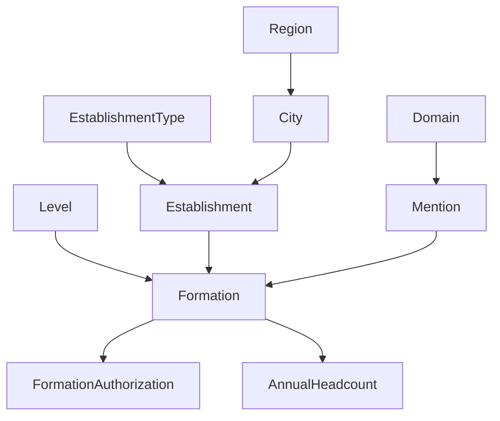

# Plan Stratégique - Migration Architecture Legacy vers /src (Phase 2)

## 📊 État Actuel de la Migration

### ✅ Complété (Phase 1)
- `City` : Entité, interface, repository, use case, controller
- `Domain` : Entité, interface, repository, use case, controller  
- `Level` : Entité, interface, repository, use case, controller
- `Region` : Entité, interface, use case (manque controller et repository)
- Architecture Clean avec TanStack Query pour Cities

### 🔄 En Cours
- CitySelector avec TanStack Query et architecture Clean
- Système DI partiellement migré

## 🎯 Analyse des Dépendances (Graphe de Dépendances)



### Entités par Niveau de Dépendance

**Niveau 1 (Indépendantes) - PRIORITÉ CRITIQUE ✨**
- ✅ `Region` (déjà en /src, manque implémentation complète)
- ✅ `Level` (déjà en /src)
- ✅ `Domain` (déjà en /src) 
- ❌ `EstablishmentType` (à migrer)

**Niveau 2 (Dépendent du Niveau 1) - PRIORITÉ HAUTE 🔥**
- ✅ `City` (déjà migré)
- ❌ `Mention` (dépend de Domain)

**Niveau 3 (Dépendent des Niveaux 1+2) - PRIORITÉ MOYENNE ⚡**
- ❌ `Establishment` (dépend de City + EstablishmentType)

**Niveau 4 (Entités Complexes) - PRIORITÉ BASSE 📚**
- ❌ `Formation` (dépend de Level + Mention + Establishment)
- ❌ `FormationAuthorization` (dépend de Formation)
- ❌ `AnnualHeadcount` (dépend de Formation)

## 🏗️ Stratégie de Migration Progressive

### Phase 2a : Compléter les Entités Critiques (Semaine 1)
**Objectif** : Finaliser les entités indépendantes

1. **Region** ⭐ URGENT
   - Créer `/src/infrastructure/repositories/regions.repository.ts`
   - Créer `/src/controllers/regions/get-regions.controller.ts`
   - Mettre à jour le module DI
   - Créer route API `/app/api/regions/route.ts` modernisée

2. **EstablishmentType** ⭐ CRITIQUE
   - Migrer `/core/entities/establishment-type.entity.ts` vers `/src/entities/models/`
   - Créer repository interface `/src/application/repositories/establishment-types.repository.interface.ts`
   - Créer use case `/src/application/use-cases/establishment-types/get-establishment-types.use-case.ts`
   - Créer repository `/src/infrastructure/repositories/establishment-types.repository.ts`
   - Créer controller `/src/controllers/establishment-types/get-establishment-types.controller.ts`
   - Module DI complet

### Phase 2b : Entités de Second Niveau (Semaine 2)
**Objectif** : Migrer les entités qui dépendent du niveau 1

3. **Mention** 
   - Migrer entité complète avec dépendance Domain
   - Architecture complète (interface → use case → repository → controller)
   - TanStack Query hook

### Phase 2c : Entités Business Complexes (Semaine 3-4)
**Objectif** : Migrer les entités métier principales

4. **Establishment**
   - Migration avec gestion des relations (City + EstablishmentType)
   - Mise à jour des filtres et composants existants
   - Migration des routes API existantes

5. **Formation**
   - Migration complexe avec multiples dépendances
   - Gestion des relations : Level, Mention, Establishment
   - Migration des composants admin existants

### Phase 2d : Finalisation (Semaine 5)
**Objectif** : Nettoyage et optimisation

6. **Nettoyage Legacy**
   - Suppression progressive `/core/entities/`
   - Suppression `/infrastructure/repositories/` legacy
   - Mise à jour imports dans tous les fichiers
   - Tests de régression complets

## 📋 Plan d'Exécution Détaillé

### 🎯 Phase 2a.1 : Region (Jour 1-2)
```typescript
// Tâches techniques précises :
1. Créer /src/infrastructure/repositories/regions.repository.ts
2. Créer /src/controllers/regions/get-regions.controller.ts  
3. Mettre à jour /di/modules/regions.module.ts
4. Mettre à jour /di/types.ts et /di/container.ts
5. Migrer /app/api/regions/route.ts vers nouvelle architecture
6. Créer hook TanStack Query /presentation/hooks/use-regions.ts
7. Tests : npm run build && npm run typecheck
```

### 🎯 Phase 2a.2 : EstablishmentType (Jour 3-4)
```typescript
// Architecture complète nouvelle entité :
1. /src/entities/models/establishment-type.entity.ts (copie optimisée /core)
2. /src/application/repositories/establishment-types.repository.interface.ts
3. /src/application/use-cases/establishment-types/get-establishment-types.use-case.ts
4. /src/infrastructure/repositories/establishment-types.repository.ts
5. /src/controllers/establishment-types/get-establishment-types.controller.ts
6. /di/modules/establishment-types.module.ts (nouveau)
7. /presentation/hooks/use-establishment-types.ts
8. Migration /app/api/establishment-types/route.ts
9. Tests complets
```

### 🎯 Phase 2b : Mention (Jour 5-7)
```typescript
// Pattern établi + gestion dépendance Domain :
1. Migration entité avec relation Domain
2. Architecture complète (pattern Cities)
3. Hook TanStack Query avec cache
4. Migration composants admin existants
5. Tests relations Domain ↔ Mention
```

## ⚠️ Points de Vigilance

### Risques Techniques
1. **Dépendances circulaires** : Formation ↔ Establishment
2. **Imports legacy** : 75+ fichiers à mettre à jour
3. **Types incompatibles** : `/core` vs `/src` entities
4. **Cache invalidation** : TanStack Query entre entités liées

### Stratégies d'Atténuation
1. **Migration atomique** : Une entité = une PR complète
2. **Tests automatisés** : `npm run build && npm run typecheck` après chaque étape
3. **Compatibilité temporaire** : Adapter `/core` import vers `/src` progressivement
4. **Rollback préparé** : Git branches séparées par entité

## 📊 Métriques de Succès

### Phase 2a (Semaine 1)
- [ ] Region 100% fonctionnelle nouvelle architecture
- [ ] EstablishmentType migré et testé
- [ ] 0 erreur TypeScript
- [ ] Build successful
- [ ] Admin pages Region + EstablishmentType fonctionnelles

### Phase 2b (Semaine 2)
- [ ] Mention avec relation Domain opérationnelle
- [ ] TanStack Query hooks pour 5+ entités
- [ ] Réduction 50%+ imports `/core/`

### Phase 2c (Semaines 3-4)  
- [ ] Establishment + Formation migrées
- [ ] Composants admin 100% nouvelle architecture
- [ ] Performance maintenue/améliorée

### Phase 2d (Semaine 5)
- [ ] 0 fichier dans `/core/entities/`
- [ ] 0 fichier dans `/infrastructure/repositories/` legacy
- [ ] Documentation architecture mise à jour
- [ ] Tests E2E passent

## 🚀 Actions Immédiates (Prochaines 48h)

1. **URGENT** : Compléter Region (repository + controller + DI)
2. **CRITIQUE** : Démarrer EstablishmentType migration complète
3. **IMPORTANT** : Valider build après chaque étape
4. **SUIVI** : Mettre à jour ce plan selon les découvertes

## 📖 Template de Migration par Entité

Pour chaque nouvelle entité, suivre ce checklist :

```typescript
// 1. Entité (/src/entities/models/)
export class EntityName { ... }

// 2. Interface Repository (/src/application/repositories/)
export interface IEntityRepository { ... }

// 3. Use Case (/src/application/use-cases/entity-name/)
export class GetEntitiesUseCase { ... }

// 4. Repository Implementation (/src/infrastructure/repositories/)
export class EntitiesRepository implements IEntityRepository { ... }

// 5. Controller (/src/controllers/entity-name/)
export class GetEntitiesController { ... }

// 6. Module DI (/di/modules/)
export const createEntityModule = () => { ... }

// 7. Hook TanStack Query (/presentation/hooks/)
export const useEntities = () => { ... }

// 8. Route API (/app/api/entities/)
export const GET = apiAuthWrapper.createProtectedHandler(...)
```

---

**Next Step** : Exécution Phase 2a.1 - Compléter Region dans les 24h prochaines.